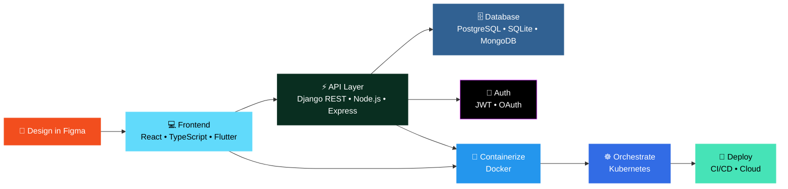

<!-- Header Wave Banner -->


<!-- Typing SVG -->
<p align="center">
  <a href="https://github.com/abrahamopm">
    
  </a>
</p>

<!-- Profile Badges -->
<p align="center">
  
  &nbsp;
  <a href="https://github.com/abrahamopm?tab=followers">
    
  </a>
  &nbsp;
  <a href="https://github.com/abrahamopm?tab=repositories">
    
  </a>
</p>

---

<!-- About Me Section -->
<h2>
  
  &nbsp;About Me
</h2>

```typescript
const abraham: Developer = {
  name: "Abraham Nigatu",
  role: "Full Stack Developer",
  location: "🌍 Building from anywhere",
  focus: [
    "Clean, responsive web applications",
    "Cross-platform mobile solutions",
    "Scalable cloud infrastructure",
    "DevOps & automation pipelines"
  ],
  currentlyLearning: "Advanced Kubernetes orchestration & microservices",
  funFact: "I turn ☕ into <code /> and ship it to production 🚀"
};
```

<br/>

<!-- Tech Stack Section -->
<h2>🛠️ Tech Arsenal</h2>

<details open>
<summary><b>🎨 Frontend</b></summary>
<br/>
<p>
  
  
  
  
  
  
  
  
</p>

> Flexbox • Grid • Responsive Design • Mobile-First • Design-to-Code
</details>

<details open>
<summary><b>⚙️ Backend</b></summary>
<br/>
<p>
  
  
  
  
  
  
</p>
</details>

<details open>
<summary><b>🗄️ Database</b></summary>
<br/>
<p>
  
  
  
</p>
</details>

<details open>
<summary><b>🚀 Infrastructure & DevOps</b></summary>
<br/>
<p>
  
  
  
  
  
  
  
  
</p>

> CI/CD Pipelines • Container Orchestration • Cloud Deployment • Infrastructure as Code
</details>

<details open>
<summary><b>🧰 Tools & Workflow</b></summary>
<br/>
<p>
  
  
  
  
  
  
</p>
</details>

<br/>

---

<!-- Architecture Diagram -->
<h2>🏗️ How I Build</h2>



<br/>

---

<!-- GitHub Stats Section -->
<h2>📊 GitHub Analytics</h2>

<p align="center">
  <a href="https://github.com/abrahamopm">
    
  </a>
  &nbsp;&nbsp;
  <a href="https://github.com/abrahamopm">
    
  </a>
</p>

<p align="center">
  <a href="https://github.com/abrahamopm">
    
  </a>
</p>

<!-- Activity Graph -->
<p align="center">
  <a href="https://github.com/abrahamopm">
    
  </a>
</p>

---

<!-- GitHub Trophies -->
<h2>🏆 GitHub Trophies</h2>

<p align="center">
  <a href="https://github.com/abrahamopm">
    
  </a>
</p>

---

<!-- What I'm Working On -->
<h2>🔭 What I'm Up To</h2>

<table>
  <tr>
    <td width="50%" valign="top">
      <h3 align="center">🌐 Web Development</h3>
      <p>
        Building full-stack applications with <b>React + TypeScript</b> frontends powered by <b>Django</b> and <b>Node.js</b> backends, secured with JWT authentication and deployed via CI/CD pipelines.
      </p>
    </td>
    <td width="50%" valign="top">
      <h3 align="center">📱 Mobile Development</h3>
      <p>
        Crafting cross-platform mobile experiences with <b>Flutter & Dart</b>, focusing on beautiful UI, smooth animations, and native performance.
      </p>
    </td>
  </tr>
  <tr>
    <td width="50%" valign="top">
      <h3 align="center">🐳 DevOps & Infrastructure</h3>
      <p>
        Containerizing applications with <b>Docker</b>, orchestrating with <b>Kubernetes</b>, and automating deployments with <b>GitHub Actions</b> CI/CD pipelines.
      </p>
    </td>
    <td width="50%" valign="top">
      <h3 align="center">🎨 Design → Code</h3>
      <p>
        Converting pixel-perfect <b>Figma</b> designs into clean, responsive, and accessible code with modern CSS techniques.
      </p>
    </td>
  </tr>
</table>

---

<!-- DevOps Pipeline -->
<h2>⚡ My DevOps Pipeline</h2>

```yaml
# abraham-ci-cd.yml
name: 🚀 Build → Test → Deploy

on:
  push:
    branches: [main]

jobs:
  pipeline:
    runs-on: ubuntu-latest
    steps:
      - name: 📥 Checkout Code
        uses: actions/checkout@v4

      - name: 🧪 Run Tests
        run: |
          python manage.py test      # Django
          npm run test               # React/Node

      - name: 🐳 Build Docker Image
        run: docker build -t app:latest .

      - name: ☸️ Deploy to Kubernetes
        run: kubectl apply -f k8s/deployment.yaml

      - name: ✅ Health Check
        run: curl -f https://app.example.com/health
```

---

<!-- Connect Section -->
<h2>🤝 Let's Connect</h2>

<p align="center">
  <a href="https://github.com/abrahamopm">
    
  </a>
  &nbsp;
  <a href="https://www.linkedin.com/in/abraham-software-dev">
    
  </a>
  &nbsp;
  <a href="mailto:abrahamnkw@gmail.com">
    
  </a>
</p>

---

<!-- Snake Animation -->
<p align="center">
  <picture>
    <source media="(prefers-color-scheme: dark)" srcset="https://raw.githubusercontent.com/abrahamopm/abrahamopm/output/github-snake-dark.svg" />
    <source media="(prefers-color-scheme: light)" srcset="https://raw.githubusercontent.com/abrahamopm/abrahamopm/output/github-snake.svg" />
    
  </picture>
</p>

<!-- Random Dev Quote -->
<p align="center">
  
</p>

<!-- Footer Wave -->


<p align="center">
  <i>⭐ From <a href="https://github.com/abrahamopm">abrahamopm</a> — Building clean code, one commit at a time.</i>
</p>
